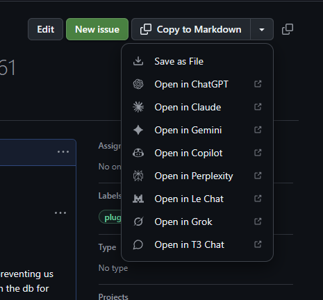
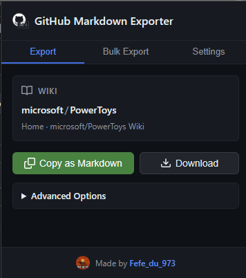
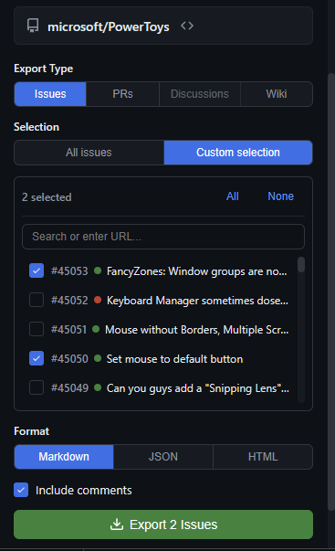

<div align="center">

# GitHub Markdown Exporter

**Export GitHub issues, PRs, discussions & wiki to markdown in one click**

[](https://chromewebstore.google.com/detail/github-markdown-exporter/dojfekdpcnkcmpkkmhlglfbiejablemb)
[](https://addons.mozilla.org/fr/firefox/addon/github-markdown-exporter/)
[](LICENSE)
[](https://github.com/Fefedu973/github-markdown-extension/issues)


[Install for Chrome](https://chromewebstore.google.com/detail/github-markdown-exporter/dojfekdpcnkcmpkkmhlglfbiejablemb) •
[Install for Firefox](https://addons.mozilla.org/fr/firefox/addon/github-markdown-exporter/) •
[Report Bug](https://github.com/Fefedu973/github-markdown-extension/issues)

</div>

---

## ✨ Features

| Feature | Description |
|---------|-------------|
| 📋 **One-Click Export** | Copy to clipboard or download as file |
| � **In-Page Button** | A "Copy to Markdown" button appears automatically on GitHub pages |
| 🐛 **Issues & PRs** | Export issues and pull requests with all comments and diffs |
| 💬 **Discussions** | Export GitHub discussions with threaded replies |
| 📚 **Full Wiki Support** | Export single pages or entire wikis |
| 🔄 **Bulk Export** | Export multiple items at once with progress tracking |
| 🤖 **AI Integration** | Send directly to ChatGPT, Claude, Gemini, Copilot, Perplexity, Le Chat, Grok, or T3 Chat |
| 📊 **Complete Data** | Includes comments, metadata, and PR diffs |
| 🔒 **Private Repos** | Works with GitHub tokens for private content |
| 🌗 **Theme Aware** | Adapts to light/dark browser themes |

## 📸 Screenshots

<div align="center">
<table>
<tr>
<td align="center"><br/><em>In-page button</em></td>
<td align="center"><br/><em>Extension popup</em></td>
<td align="center"><br/><em>Bulk export</em></td>
</tr>
</table>
</div>

## 📦 Installation

<table>
<tr>
<td align="center" width="50%">

### Chrome

[](https://chromewebstore.google.com/detail/github-markdown-exporter/dojfekdpcnkcmpkkmhlglfbiejablemb)

[**Install from Chrome Web Store →**](https://chromewebstore.google.com/detail/github-markdown-exporter/dojfekdpcnkcmpkkmhlglfbiejablemb)

</td>
<td align="center" width="50%">

### Firefox

[](https://addons.mozilla.org/fr/firefox/addon/github-markdown-exporter/)

[**Install from Firefox Add-ons →**](https://addons.mozilla.org/fr/firefox/addon/github-markdown-exporter/)

</td>
</tr>
</table>

## 🚀 Usage

### In-Page Button
A **"Copy to Markdown"** button appears automatically on every GitHub issue, PR, discussion, and wiki page. Click it to copy, or use the dropdown to select a different export option or AI provider.

### Popup Menu
Click the extension icon for:
- **Export Tab** — Export current page with format options
- **Bulk Tab** — Export multiple items from any repository
- **Settings** — Configure GitHub token and AI providers

### Export Formats
- **Markdown** — Clean, readable `.md` files
- **JSON** — Structured data with all metadata  
- **HTML** — Styled document ready to view

## 🔐 Private Repositories

1. Go to [GitHub Token Settings](https://github.com/settings/tokens)
2. Create a token with `repo` scope
3. Open extension settings and save the token

## 🛠️ Development

```bash
# Clone & install
git clone https://github.com/Fefedu973/github-markdown-extension.git
cd github-markdown-extension
bun install

# Build
bun run build

# Load in browser
# Chrome: chrome://extensions → Load unpacked → select dist/
# Firefox: about:debugging → Load Temporary Add-on → select dist/manifest.json
```

## 📄 License

MIT — See [LICENSE](LICENSE) for details.

---

<div align="center">
Made with ❤️ for the GitHub community
</div>
